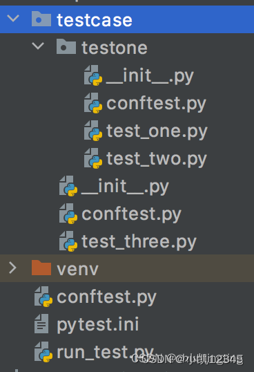

#   安装
##   安装pytest
    输入：pip install pytest 或者已安装输入：pip install -U pytest 

#   验证
##   验证安装
    输入：pytest -v

#   pytest框架的约束
##   1. pytest的命名规则
    1. py文件全部小写，多个英文用 _ 隔开
    2. class名首字母大写，驼峰
    3. 函数和方法名小写，多个英文用 _ 隔开
    4. 全局变量，前面要加global
    5. 常量字母必须全大写，例如：AGE_OF_NICK

##   2. ptest的命名规则
    1. 模块名（py文件）必须是以test_ 开头或者 _test结尾
    2. 测试类（class）必须以Test开头，并且不能带init方法，类里的方法必须以test_ 开头
    3. 测试用例（函数）必须以test_ 开头。

#   pytest的运行方式
##  1.主函数运行
    import  pytest
     
    def test_01():
        print("啥也没有")
     
    if __name__=='__main__':
        pytest.main()
##  main 中可使用的参数有：

##  命令行运行
    例如：我的py文件存放在：\pytest_testcase\test_01.py
    终端输入： pytest .\test_01.py --html=./report/report.html

##  pytest.ini 配置文件方式运行
    不管是main执行方式还是命令执行，最终都回去读取pytest.ini文件
    在项目的根目录下创建pytest.ini文件 
    pytest.ini 文件尽可能不要出现中文

#   pytest配置文件中pytest.ini 文件
    pytest的配置文件通常放在测试目录下，名称为pytest.ini，命令运行时会使用该配置文件中的配置。

    #配置pytest命令行运行参数
       [pytest]
        addopts = -s ... # 空格分隔，可添加多个命令行参数 -所有参数均为插件包的参数配置测试搜索的路径
        testpaths = ./scripts  # 当前目录下的scripts文件夹 -可自定义
    #配置测试搜索的文件名称
        python_files = test*.py 
    #当前目录下的scripts文件夹下，以test开头，以.py结尾的所有文件 -可自定义
    配置测试搜索的测试类名
        python_classes = Test_*  
     
       #当前目录下的scripts文件夹下，以test开头，以.py结尾的所有文件中，以Test开头的类 -可自定义
    配置测试搜索的测试函数名
      
        python_functions = test_*
     
    #当前目录下的scripts文件夹下，以test开头，以.py结尾的所有文件中，以Test开头的类内，以test_开头的方法 -可自定义

#   pytest中conftest.py文件
##  conftest.py的特点
    pytest 会默认读取 conftest.py里面的所有 fixture
    conftest.py 文件名称是固定的，不能改动
    conftest.py 只对同一个 package 下的所有测试用例生效
    不同目录可以有自己的 conftest.py，一个项目中可以有多个 conftest.py
    测试用例文件中不需要手动 import conftest.py，pytest 会自动查找

##   conftest.py的示例目录
    最顶层的conftest.py 一般写全局的fixture

#   pytest中fixture装饰器
    虽然setup和teardown可以执行一些前置和后置操作，但是这种是针对整个脚本全局生效的
    如果有以下场景：1.用例一需要执行登录操作；2.用例二不需要执行登录操作；3.用例三需要执行登录操作，则setup和teardown则不满足要求。fixture可以让我自定义测试用例的前置条件

##   fixtrue的优势
    命名方式灵活，不限于setup和teardown两种命名
    conftest.py可以实现数据共享，不需要执行import 就能自动找到fixture
    scope=module，可以实现多个.py文件共享前置
    scope=“session” 以实现多个.py 跨文件使用一个 session 来完成多个用例

##   Fixture的调用方式：
    @pytest.fixture(scope = "function",params=None,autouse=False,ids=None,name=None)

##   Fixture的作用范围

##   fixtrue参数详解-scope 
    用于控制Fixture的作用范围
    作用类似于Pytest的setup/teardown
    默认取值为function（函数级别），控制范围的排序为：session > module > class > function

##   scope = “function”
    场景一：做为参数传入
    import pytest
    # fixture函数(类中) 作为多个参数传入
    @pytest.fixture()
    def login():
        print("打开浏览器")
        a = "account"
        return a
        
    @pytest.fixture()
    def logout():
        print("关闭浏览器")
     
    class TestLogin:
        #传入lonin fixture
        def test_001(self, login):
            print("001传入了loging fixture")
            assert login == "account"
     
        #传入logout fixture
        def test_002(self, logout):
            print("002传入了logout fixture")
     
        def test_003(self, login, logout):
            print("003传入了两个fixture")
     
        def test_004(self):
            print("004未传入仍何fixture哦")
     
    if __name__ == '__main__':
        pytest.main()

 
 
    从运行结果可以看出，fixture做为参数传入时，会在执行函数之前执行该fixture函数。再将值传入测试函数做为参数使用，这个场景多用于登录

    场景二：Fixture的相互调用
    import pytest
    # fixtrue作为参数，互相调用传入
    @pytest.fixture()
    def account():
        a = "account"
        print("第一层fixture")
        return a
        
    #Fixture的相互调用一定是要在测试类里调用这层fixture才会生次，普通函数单独调用是不生效的
    @pytest.fixture()   
    def login(account):
        print("第二层fixture")
     
    class TestLogin:
        def test_1(self, login):
            print("直接使用第二层fixture,返回值为{}".format(login))
     
        def test_2(self, account):
            print("只调用account fixture,返回值为{}".format(account))
     
     
    if __name__ == '__main__':
        pytest.main()

    1.即使fixture之间支持相互调用，但普通函数直接使用fixture是不支持的，一定是在测试函数内调用才会逐级调用生效
    2.有多层fixture调用时，最先执行的是最后一层fixture，而不是先执行传入测试函数的fixture
    3.上层fixture的值不会自动return,这里就类似函数相互调用一样的逻辑

##   scope = “class”
    **当测试类内的每一个测试方法都调用了fixture，fixture只在该class下所有测试用例执行前执行一次
    **测试类下面只有一些测试方法使用了fixture函数名，这样的话，fixture只在该class下第一个使用fixture函数的测试用例位置开始算，后面所有的测试用例执行前只执行一次。而该位置之前的测试用例就不管。
    语法

    @pytest.fixture(scope='class')
    场景一：
    import pytest
    # fixture作用域 scope = 'class'
    @pytest.fixture(scope='class')
    def login():
        print("scope为class")
     
     
    class TestLogin:
        def test_1(self, login):
            print("用例1")
     
        def test_2(self, login):
            print("用例2")
     
        def test_3(self, login):
            print("用例3")
     
     
    if __name__ == '__main__':
        pytest.main()

    场景二：
    import pytest
    @pytest.fixture(scope='class')
    def login():
        a = '123'
        print("输入账号密码登陆")
     
    class TestLogin:
        def test_1(self):
            print("用例1")
     
        def test_2(self, login):
            print("用例2")
     
        def test_3(self, login):
            print("用例3")
     
        def test_4(self):
            print("用例4")
     
    if __name__ == '__main__':
        pytest.main()

##   scope = “module”：与class相同，只从.py文件开始引用fixture的位置生效
    import pytest
    # fixture scope = 'module'
    @pytest.fixture(scope='module')
    def login():
        print("fixture范围为module")
     
     
    def test_01():
        print("用例01")
     
     
    def test_02(login):
        print("用例02")
     
     
    class TestLogin():
        def test_1(self):
            print("用例1")
     
        def test_2(self):
            print("用例2")
     
        def test_3(self):
            print("用例3")
     
    if __name__ == '__main__':
        pytest.main()

##  scope = “session”：
    session的作用范围是针对.py级别的，module是对当前.py生效，seesion是对多个.py文件生效
    session只作用于一个.py文件时，作用相当于module
    所以session多数与contest.py文件一起使用，做为全局Fixture

##  fixtrue参数详解-autouse
    默认False
    若为True，刚每个测试函数都会自动调用该fixture,无需传入fixture函数名
    由此我们可以总结出调用fixture的三种方式：
    　　1.函数或类里面方法直接传fixture的函数参数名称
    　　2.使用装饰器@pytest.mark.usefixtures()修饰
    　　3.autouse=True自动调用，无需传仍何参数，作用范围跟着scope走（谨慎使用）
    让我们来看一下，当autouse=ture的效果：

##  fixtrue参数详解params
    Fixture的可选形参列表，支持列表传入
    默认None，每个param的值
    fixture都会去调用执行一次，类似for循环
    可与参数ids一起使用，作为每个参数的标识，详见ids
    被Fixture装饰的函数要调用是采用：Request.param(固定写法，如下图)
    举个栗子：

##  fixtrue参数详解-ids
    用例标识ID与params配合使用，一对一关系
    举个栗子：
    未配置ids之前，用例：

    配置了IDS后：

##  fixtrue参数详解-name
    fixture的重命名
    通常来说使用 fixture 的测试函数会将 fixture 的函数名作为参数传递，但是 pytest 也允许将fixture重命名
    如果使用了name,那只能将name传如，函数名不再生效
    调用方法：@pytest.mark.usefixtures(‘fixture1’,‘fixture2’)
    举栗：

    import pytest
    @pytest.fixture(name="new_fixture")
    def test_name():
        pass
        
    #使用name参数后，传入重命名函数，执行成功
    def test_1(new_fixture):
        print("使用name参数后，传入重命名函数，执行成功")
     
    #使用name参数后，仍传入函数名称，会失败
    def test_2(test_name):
        print("使用name参数后，仍传入函数名称，会失败")

